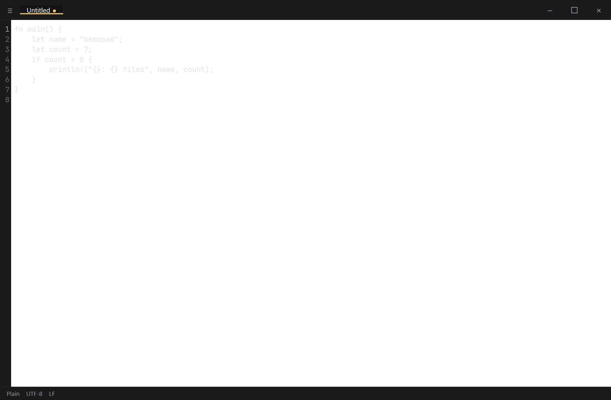
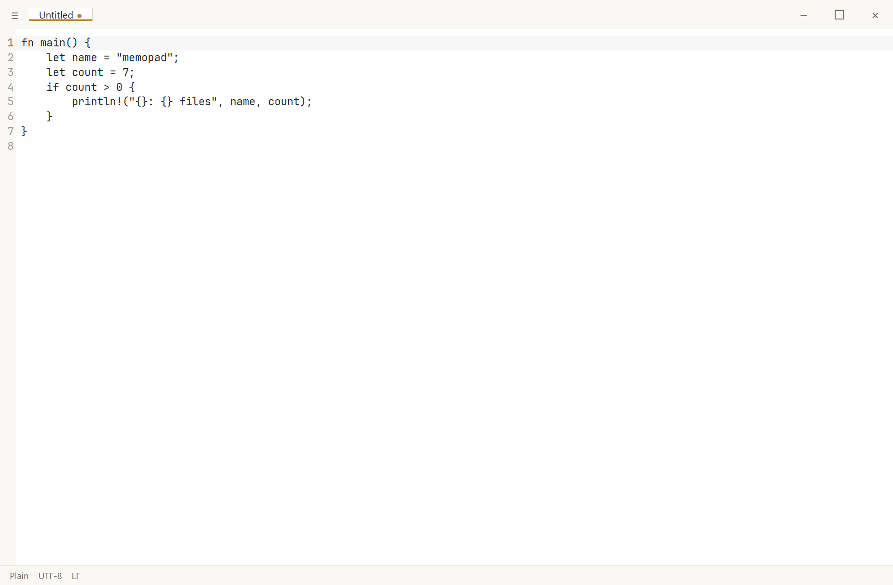
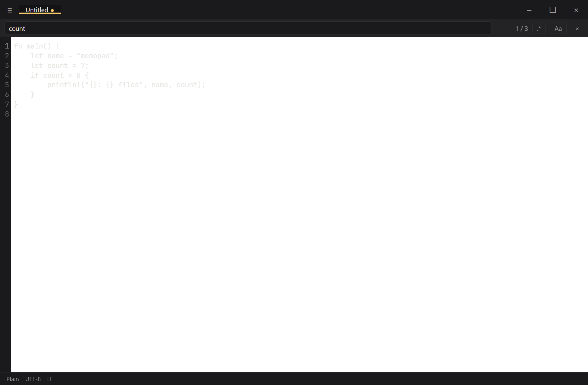

# Memopad

A trim, modern alternative to Notepad++ that does two things noticeably better:

- **Never loses your work.** Every keystroke is journaled to disk within 250 ms;
  after a force-kill or power cut, every dirty buffer comes back exactly as you
  left it.
- **Looks good out of the box.** Warm-neutral light and dark themes, JetBrains
  Mono bundled, chromeless title bar, command palette.




## Features

### Editing
- Multi-buffer editing with drag-reorderable tabs in the title bar
- Syntax highlighting for Rust, JavaScript / TypeScript, JSON, Markdown
- Inline find / replace with regex (`Ctrl+F` / `Ctrl+H`)
- Split view (`Ctrl+\`) — two horizontal panes with per-pane cursor + scroll
- Memopad Dark + Memopad Light themes, follow system preference by default
- Encoding-aware (UTF-8, UTF-8 BOM, UTF-16 LE/BE) with round-trip preservation

### Workspace (v0.2)
- Open a folder once (`Ctrl+K Ctrl+O`); recent folders list (`Ctrl+R`)
- File tree sidebar (`Ctrl+B`) with lazy expand + right-click context menu
- Find in files (`Ctrl+Shift+F`) — ripgrep-powered, click-to-jump
- Replace in files with confirm dialog, dirty-buffer block, backref-aware preview
- Quick open by filename (`Ctrl+P`) — fuzzy match across the workspace
- Live filesystem watcher — tree auto-refreshes and external-change banner fires without refocusing

### Reliability
- Command palette (`Ctrl+Shift+P`) — every action reachable by keyboard
- Bulletproof crash recovery — journal-backed dirty buffer restoration
- Session restore — reopen the same tabs (and workspace folder) on relaunch
- External-change detection with Reload / Keep mine / Diff view
- Auto-update via GitHub Releases

## Install

Memopad is currently Windows-only. macOS and a web build are planned for v2.

1. Download the latest `Memopad_*.msi` from the [Releases](https://github.com/zhijiewong/memopad/releases) page.
2. Run the installer. Windows SmartScreen will show an "unrecognized app" warning
   because the binary is not yet code-signed. Click **More info → Run anyway**.
3. Launch Memopad from the Start menu.

To uninstall: Settings → Apps → Memopad → Uninstall.

## Keyboard shortcuts

| Action | Shortcut |
| --- | --- |
| Command palette | `Ctrl+K` or `Ctrl+Shift+P` |
| Quick open by filename | `Ctrl+P` |
| Open file | `Ctrl+O` |
| Open folder | `Ctrl+K Ctrl+O` |
| Open recent folder | `Ctrl+R` |
| Save | `Ctrl+S` |
| Save as | `Ctrl+Shift+S` |
| New tab | `Ctrl+N` |
| Close tab | `Ctrl+W` |
| Reopen closed tab | `Ctrl+Shift+T` |
| Next / Previous tab | `Ctrl+Tab` / `Ctrl+Shift+Tab` |
| Find in buffer | `Ctrl+F` |
| Replace in buffer | `Ctrl+H` |
| Find in files (sidebar) | `Ctrl+Shift+F` |
| Toggle sidebar | `Ctrl+B` |
| Toggle Files / Search tab | `Ctrl+Shift+E` |
| Toggle split view | `Ctrl+\` |

All shortcuts are also reachable through the command palette.

## Themes

| Memopad Dark | Memopad Light |
| --- | --- |
|  |  |

## Find and replace



## Building from source

Prerequisites:

- Node 20+, npm 10+
- Rust 1.75+ (`rustup default stable`)
- Microsoft Visual C++ Build Tools (Desktop development with C++ workload)
- WebView2 runtime (preinstalled on Windows 11)

```powershell
git clone https://github.com/zhijiewong/memopad.git
cd memopad
npm install
npm run tauri build
```

The MSI and NSIS installers land under `src-tauri/target/release/bundle/`.

## Development

```powershell
npm run dev          # Vite dev server only
npm run tauri dev    # Vite + Tauri shell, hot reload
npm test             # Vitest UI unit tests
npm run test:e2e     # WebdriverIO end-to-end suite
```

See `docs/superpowers/specs/2026-05-25-memopad-design.md` for the design
specification and `docs/superpowers/plans/` for the implementation history.

## License

MIT. JetBrains Mono is bundled under the SIL Open Font License 1.1.
