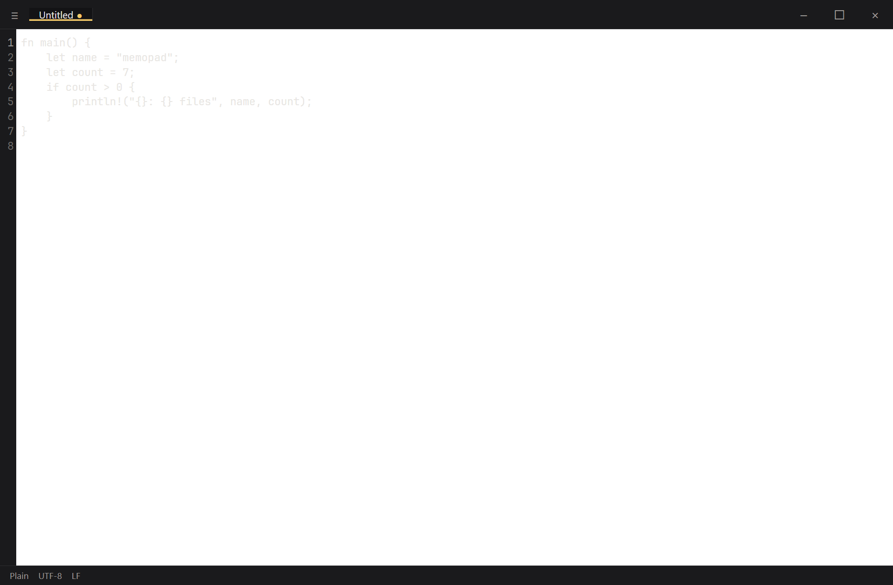
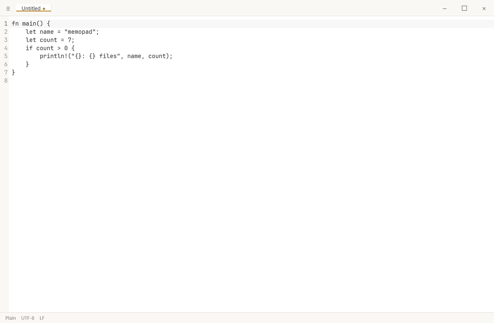

# Memopad

A trim, modern alternative to Notepad++ for Windows — a quiet, fast editor with a
real file manager and multiple restorable windows, that **never loses your work**.

- **Never loses your work.** Every keystroke is journaled to disk within 250 ms;
  after a force-kill or power cut, every dirty buffer comes back exactly as you left it.
- **Looks good out of the box.** Warm-neutral light and dark themes, JetBrains Mono
  bundled, chromeless title bar, command palette for everything.




## Features

### Editing
- Multi-buffer editing with drag-reorderable tabs in the title bar
- Syntax highlighting for Rust, JavaScript / TypeScript, JSON, Markdown
- Inline find / replace with regex (`Ctrl+F` / `Ctrl+H`)
- **Word wrap** (`Alt+Z`), **indentation guides**, and a code **minimap** — toggleable
  from the command palette, remembered across relaunch
- **Line operations** — duplicate (`Ctrl+D`), move up/down (`Alt+↑/↓`), delete
  (`Ctrl+Shift+K`)
- **Go to Line** (`Ctrl+G`) and a live **Ln / Col** indicator in the status bar
- Encoding-aware (UTF-8, UTF-8 BOM, UTF-16 LE/BE) with round-trip preservation
- Memopad Dark + Memopad Light themes; follow system preference by default

### Files & workspace
- Open a folder (`Ctrl+K Ctrl+O`); **recent folders** (`Ctrl+R`) and **recent files**
  (`Ctrl+E`)
- **File tree sidebar** (`Ctrl+B`) with lazy expand and a right-click context menu
- **Create / rename / delete** files and folders right in the tree (delete → Recycle Bin)
- **Drag-to-move** files and folders between folders; open editors follow the move
- **Find in files** (`Ctrl+Shift+F`) — ripgrep-powered, click-to-jump
- **Replace in files** with confirm dialog, dirty-buffer block, backref-aware preview
- **Quick open by filename** (`Ctrl+P`) — fuzzy match across the workspace
- Live filesystem watcher — the tree auto-refreshes; a clear banner appears if live
  updates ever become unavailable

### Windows & layout
- **Multiple windows** (`Ctrl+Shift+N`) — each with its own tabs, workspace, and split
- **Split view** (`Ctrl+\`) — two horizontal panes with per-pane cursor + scroll;
  focus a pane with `Ctrl+1` / `Ctrl+2`
- **Session restore** — every open window returns on relaunch with its tabs and workspace
- **Quit** (`Ctrl+Q`) preserves your window layout; closing a single window with × forgets
  just that window

### Reliability
- Command palette (`Ctrl+Shift+P`) — every action reachable by keyboard
- Bulletproof crash recovery — journal-backed dirty-buffer restoration, per window
- External-change detection with Reload / Keep mine / Diff view
- Auto-update via GitHub Releases

## Install

Memopad is Windows-only.

1. Download the latest `Memopad_*.msi` (or `*-setup.exe`) from the
   [Releases](https://github.com/zhijiewong/memopad/releases) page.
2. Run the installer. Windows SmartScreen shows an "unrecognized app" warning because the
   binary is not code-signed. Click **More info → Run anyway**.
3. Launch Memopad from the Start menu. It auto-updates from future releases.

To uninstall: Settings → Apps → Memopad → Uninstall.

## Keyboard shortcuts

| Action | Shortcut |
| --- | --- |
| Command palette | `Ctrl+K` or `Ctrl+Shift+P` |
| Quick open by filename | `Ctrl+P` |
| Open recent file | `Ctrl+E` |
| Open file | `Ctrl+O` |
| Open folder | `Ctrl+K Ctrl+O` |
| Open recent folder | `Ctrl+R` |
| Save / Save as | `Ctrl+S` / `Ctrl+Shift+S` |
| New tab / Close tab | `Ctrl+N` / `Ctrl+W` |
| Reopen closed tab | `Ctrl+Shift+T` |
| Next / Previous tab | `Ctrl+Tab` / `Ctrl+Shift+Tab` |
| New window | `Ctrl+Shift+N` |
| Quit (preserves window layout) | `Ctrl+Q` |
| Find / Replace in buffer | `Ctrl+F` / `Ctrl+H` |
| Find in files | `Ctrl+Shift+F` |
| Go to line | `Ctrl+G` |
| Duplicate line | `Ctrl+D` |
| Move line up / down | `Alt+↑` / `Alt+↓` |
| Delete line | `Ctrl+Shift+K` |
| Word wrap | `Alt+Z` |
| Toggle sidebar | `Ctrl+B` |
| Toggle Files / Search tab | `Ctrl+Shift+E` |
| Toggle split view | `Ctrl+\` |
| Focus primary / secondary pane | `Ctrl+1` / `Ctrl+2` |
| Rename / delete tree item | `F2` / `Delete` |

Indent guides and the minimap toggle from the command palette ("View: Toggle …"). All
shortcuts are also reachable through the command palette.

## Themes

| Memopad Dark | Memopad Light |
| --- | --- |
|  |  |

## Building from source

Prerequisites:

- Node 20+, npm 10+
- Rust 1.75+ (`rustup default stable`)
- Microsoft Visual C++ Build Tools (Desktop development with C++ workload)
- WebView2 runtime (preinstalled on Windows 11)

```powershell
git clone https://github.com/zhijiewong/memopad.git
cd memopad
npm install
npm run tauri build
```

The MSI and NSIS installers land under `src-tauri/target/release/bundle/`.

## Development

```powershell
npm run dev          # Vite dev server only
npm run tauri dev    # Vite + Tauri shell, hot reload
npm test             # Vitest unit tests
npm run test:e2e     # WebdriverIO end-to-end suite (builds the release binary first)
```

See `docs/superpowers/specs/` for the design specs and `docs/superpowers/plans/` for the
implementation history.

## License

MIT. JetBrains Mono is bundled under the SIL Open Font License 1.1.
